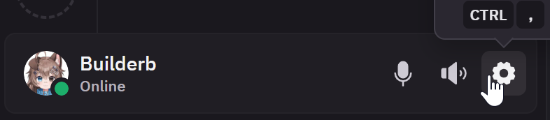
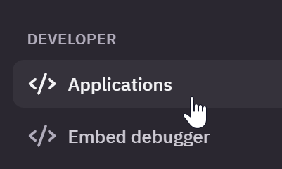
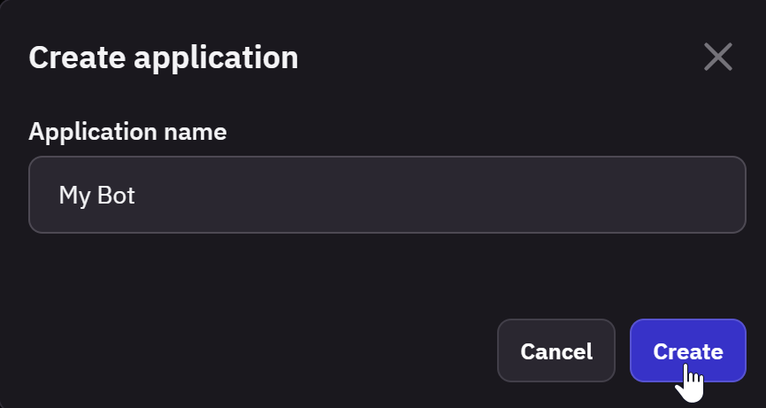
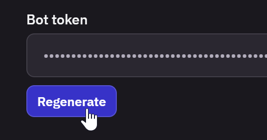

# Create Bot
You need to create a bot/app on Fluxer using these steps.

| | |
| -------- | ------- |
| Go to User Settings |  |
| Scroll down to Applications |  |
| Create a app with name |  |
| Generate your bot token and copy this into your code |  |