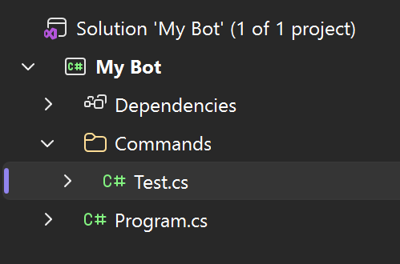
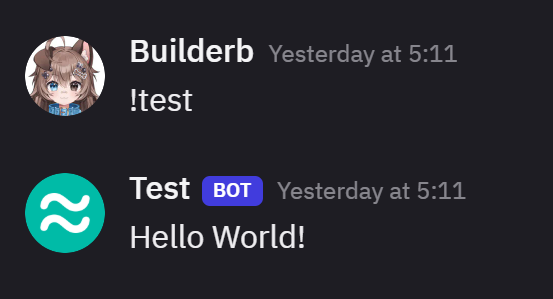

# Using Commands
You will need to use the message create event to listen for commands and respond back.

Here is an example of the command system that uses a default starting prefix.

[!code-csharp[Commands](../example/samples/commands.cs)]

## Command Modules
Create a folder in your project for Commands and then create a Test.cs file.

[!code-csharp[Commands](../example/samples/module.cs)]

## Run Command
When the user runs the test command with the starting prefix your bot will respond back with Hello World!

