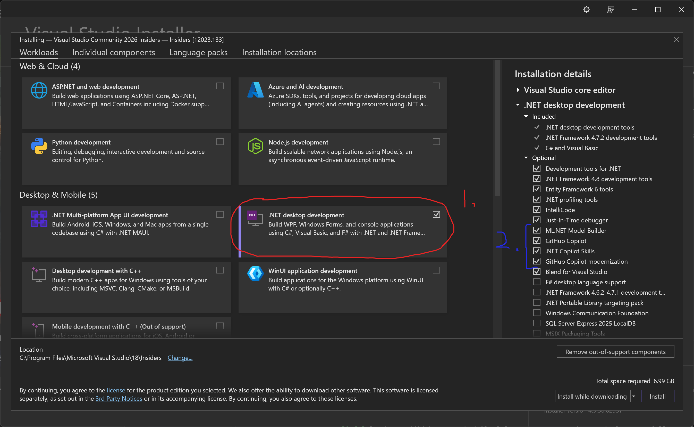

# Install Editor
To start programming you will need to install a code editor!

[Visual Studio 2026](https://visualstudio.microsoft.com) is free and recommended for C# programming.

You will need 8GB ram and 10GB storage otherwise use a lighter alternative such as [Visual Studio Code](https://code.visualstudio.com)

## Install
* Click Get free download for [Visual Studio 2026](https://visualstudio.microsoft.com)
* Run VisualStudioSetup.exe
* Select .NET desktop development (1)
* Optionally disable AI features (2)
* Click Install at the bottom right.

