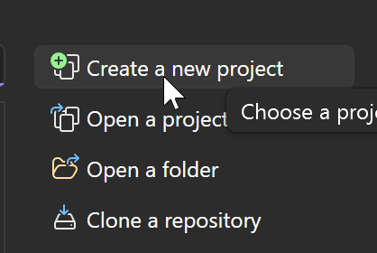
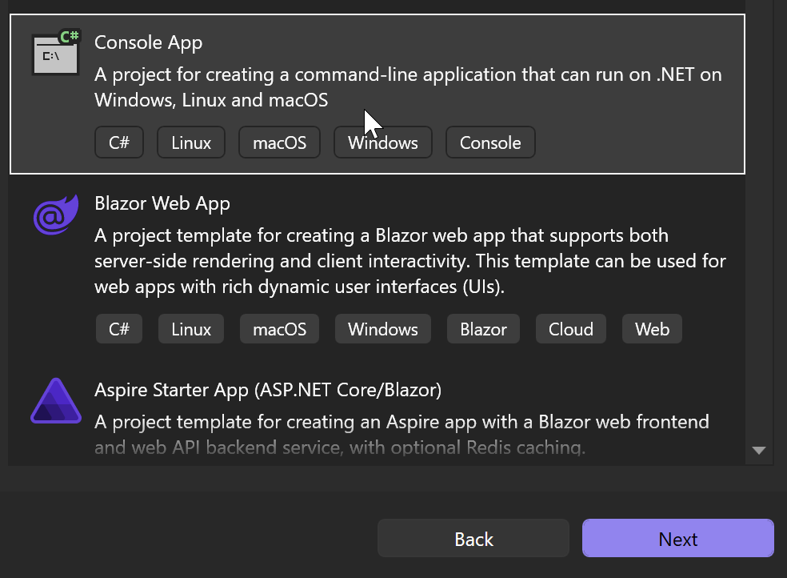
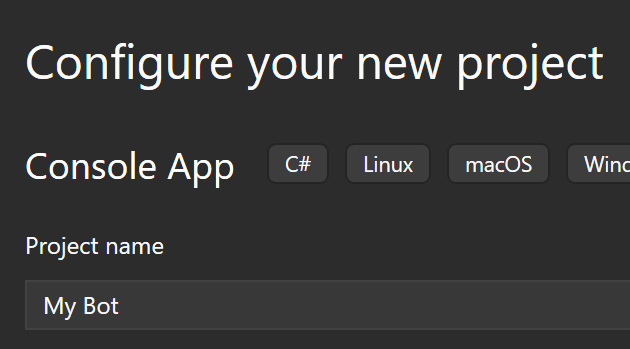
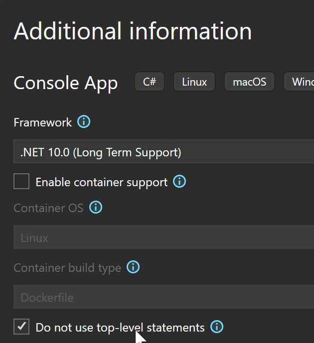
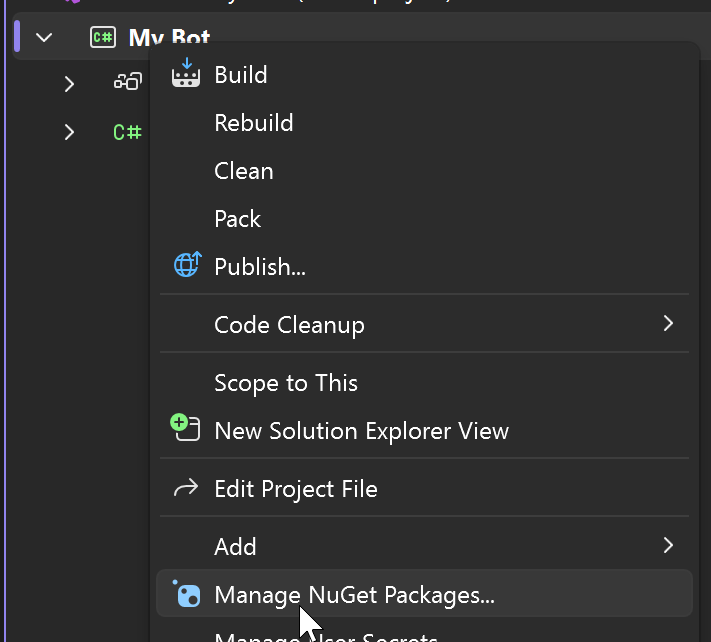
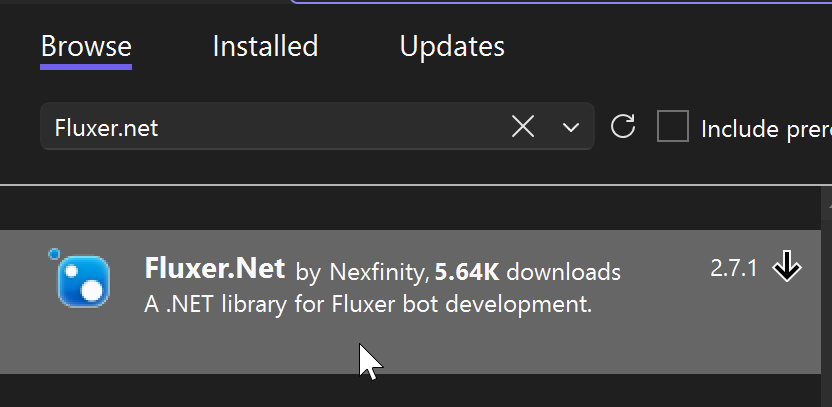

# Create Project
Use Visual Studio to start making your Fluxer bot!

| | |
| -------- | ------- |
| Click Create Project |  |
| Create Console App |  |
| Enter a name for your bot |  |
| Configure the project with .NET 8 or higher and check Do not use top level |  |

## Project Code
You will need to update your code and install Fluxer.net

> [!NOTE]
> Change your Program class to look like this
> [!code-csharp[Program](samples/program.cs)]

| | |
| -------- | ------- |
| Right click your project in the sidebar and select Manage NuGet Packages |  |
| Search for Fluxer.net and install the package |  |
| Update your code to use Fluxer.net with the example below | |

[!code-csharp[Program](../example/samples/client.cs)]